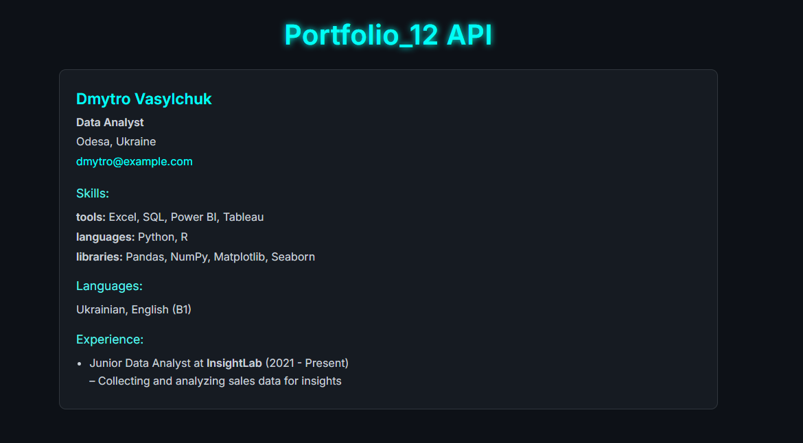

 
# ⚡ Portfolio_12 API – Resume Viewer 🌙



It fetches JSON resumes from a custom API and displays them.

Built with **React + TypeScript**

---

## ✨ Features

✅ Dark UI with neon accent  
✅ Fully mobile responsive (Android/iOS)  
✅ Pulls live data from [Resume API](https://portfolio-api-vercel-kappa.vercel.app/api/resume)  
✅ Clean codebase (modular + typed)

---

## 🚀 Demo

🔗 [Live Site →](https://Antot-12.github.io/Portfolio_12-API)

---

## 🖼 Preview


---

## 📦 Tech Stack

- ⚛️ React 18 + Vite + TypeScript
- 🎨 CSS Modules
- 🧪 Clean project structure
- 🔧 Deployed via `gh-pages`

---

## 🛠 How to Install Locally

```bash
git clone https://github.com/Antot-12/Portfolio_12-API.git

cd Portfolio_12-API

npm install

npm start
````

Then open [http://localhost:3000](http://localhost:3000) in your browser 👨‍💻

---

## 🧑‍💻 Project Structure

```
src/
├── components/        // Reusable UI components
├── types/             // TypeScript interfaces
├── styles/            // App.module.css (modular styles)
├── App.tsx            // Main app
├── index.tsx          // Entry point
```

---

## 🌍 Deployment to GitHub Pages

Already set up! To deploy again:

```bash
npm run deploy
```

Your site will be live at:
👉 `https://Antot-12.github.io/Portfolio_12-API`


---
